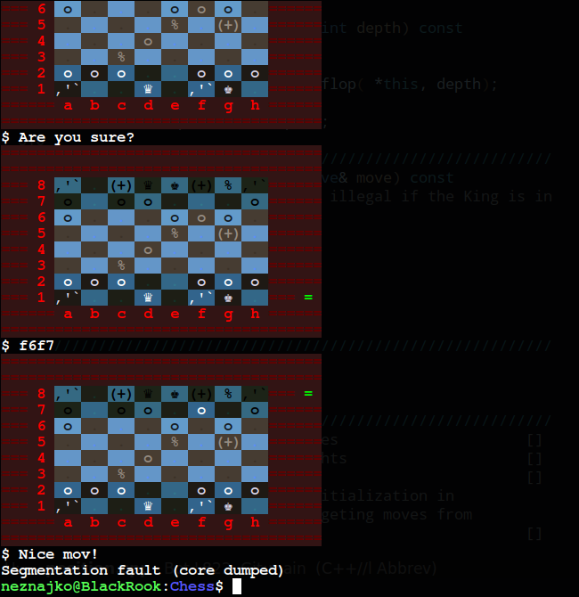

# Chess
***à personal projéct***
## VAR *0.01*
The program iz'n wery preliminary state, namely variant *0.01* I guess?
It's ideal if you want to test your theoretical knowledge in
a2-a4 systems, not to mention ping-pong defense in h2-h3 triple pawn
center( a.k.a free beer award) variant.

```Python
You have problem solving mate in two? Chess program is your best bet!
Just load the position and go to a restraint than when you come back
your problem will be solved!
```


